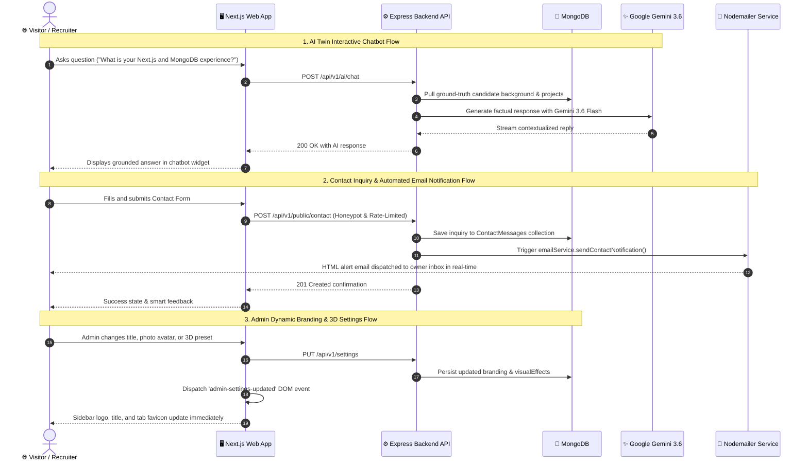

# Developer Portfolio & Secure Admin Dashboard

A full-stack, responsive developer portfolio with an integrated admin dashboard. Built with **Next.js App Router** for the frontend, **Node.js with Express** for the versioned REST API, **MongoDB with Mongoose** for persistent storage, and **Multer** for local file and media uploads.

All source files are strictly written in **JavaScript (`.js` files)** with JSX embedded directly inside `.js` files.

---

## Complete Website Architecture & Sitemap Chart

```mermaid
graph TD
    classDef client fill:#1e293b,stroke:#3b82f6,stroke-width:2px,color:#f8fafc;
    classDef public fill:#0f172a,stroke:#10b981,stroke-width:2px,color:#f8fafc;
    classDef admin fill:#1e1e38,stroke:#8b5cf6,stroke-width:2px,color:#f8fafc;
    classDef backend fill:#0c1322,stroke:#f59e0b,stroke-width:2px,color:#f8fafc;
    classDef external fill:#1f2937,stroke:#ec4899,stroke-width:2px,color:#f8fafc;

    User["🌐 Visitor / Recruiter"]:::client
    AdminUser["🔐 Site Administrator"]:::client

    subgraph Frontend["🖥️ Next.js 14 Frontend Application (port 3000)"]
        subgraph PublicPages["Public Website Layer (/)"]
            Home["🏠 / (Home Page)"]:::public
            HeroSec["✨ 3D Hero & Three.js Canvas"]:::public
            AboutSec["👤 About & Bio"]:::public
            SkillsSec["⚡ Skills & Tech Stack"]:::public
            ExpSec["💼 Work Experience Timeline"]:::public
            ProjectsSec["🚀 Featured Projects Grid"]:::public
            EduSec["🎓 Education & Certifications (with CGPA)"]:::public
            ContactSec["📬 Contact Form (Nodemailer Trigger)"]:::public
            ProjectDetail["📄 /projects/[slug] (Case Study & AI Lens)"]:::public
            AITwin["🤖 Chakit's AI Twin Chatbot"]:::public
            JobMatcher["🎯 AI Recruiter Job-Fit Matcher"]:::public
            FaviconHead["🎨 Dynamic Favicon Manager"]:::public
        end

        subgraph AdminPages["Admin Console Layer (/admin)"]
            AdminLogin["🔑 /admin/login (Session Auth Shell)"]:::admin
            AdminDashboard["📊 /admin (Overview & Real Metrics)"]:::admin
            AdminProfile["👤 /admin/profile (Bio, Roles, Photo & Title)"]:::admin
            AdminProjects["📁 /admin/projects (CRUD & AI Copilot)"]:::admin
            AdminSkills["🛠️ /admin/skills (Tech Stack & Categories)"]:::admin
            AdminExp["💼 /admin/experience (Career Timeline)"]:::admin
            AdminEdu["🎓 /admin/education (Degrees & Percentage/CGPA)"]:::admin
            AdminCerts["🏆 /admin/certifications (Credentials)"]:::admin
            AdminMedia["🖼️ /admin/media (Multer Storage & Protection)"]:::admin
            AdminMessages["📥 /admin/messages (Inbox & AI 1-Click Reply)"]:::admin
            AdminSettings["⚙️ /admin/settings (4-Box 3D & Favicon Uploader)"]:::admin
            AdminSecurity["🛡️ /admin/account (Security & Password Reset)"]:::admin
        end
    end

    subgraph BackendAPI["⚙️ Express.js REST API (port 5000 /api/v1)"]
        PublicAPI["/public/portfolio & /public/contact"]:::backend
        AuthAPI["/auth/login, /auth/me, /auth/csrf"]:::backend
        CRUDAPI["/projects, /skills, /experience, /education, /settings"]:::backend
        AIService["AI Service Controller (Gemini 3.6 Flash)"]:::backend
        EmailService["Nodemailer Notification Service"]:::backend
        UploadService["Multer Upload & File Protection Service"]:::backend
    end

    subgraph ExternalServices["☁️ External Cloud Services & Storage"]
        MongoDB[("🍃 MongoDB Database (Atlas / Local)")]:::external
        GeminiAI["✨ Google Gemini 3.6 Flash"]:::external
        SMTP["📧 SMTP Server (Gmail / Nodemailer)"]:::external
        LocalStorage["📁 backend/uploads/ Storage"]:::external
    end

    %% Visitor flows
    User --> Home
    User --> ProjectDetail
    User --> AITwin
    User --> JobMatcher
    Home --> ContactSec

    %% Admin flows
    AdminUser --> AdminLogin
    AdminLogin --> AdminDashboard
    AdminDashboard --> AdminProfile
    AdminDashboard --> AdminProjects
    AdminDashboard --> AdminSettings
    AdminDashboard --> AdminMessages

    %% Frontend to Backend flows
    PublicPages --> PublicAPI
    AITwin --> AIService
    JobMatcher --> AIService
    ContactSec --> PublicAPI
    AdminPages --> AuthAPI
    AdminPages --> CRUDAPI
    AdminSettings --> CRUDAPI
    AdminMedia --> UploadService

    %% Backend to External flows
    CRUDAPI --> MongoDB
    PublicAPI --> MongoDB
    PublicAPI --> EmailService
    EmailService --> SMTP
    AIService --> GeminiAI
    UploadService --> LocalStorage
```



---

## Data Flow & Event Lifecycle Chart



---

## Features

### Public Portfolio
- **Automated Nodemailer Inquiries**: Submitting the contact form immediately notifies the portfolio owner via clean, responsive HTML email with instant sender details and a direct reply action.
- **Floating AI Portfolio Assistant ("Chakit's AI Twin")**: Grounded conversational widget powered by Google Gemini 3.6 Flash and live MongoDB records. Answers inquiries about full-stack experience, Next.js, MongoDB, Kiddocracy, REST APIs, and career background.
- **AI Recruiter Role Fit Matcher**: Recruiter tool that parses job descriptions, calculates candidate compatibility percentage, lists direct skill matches vs. ramp-up areas, and recommends relevant projects to review.
- **AI Case Study Perspectives Lens**: Multi-perspective summary generator on `/projects/[slug]` with 1-click modes: *Recruiter 30s TL;DR*, *Tech Lead Deep-Dive*, and *Non-Tech Layman Analogy*.
- **Education & Academic Scores**: Dedicated percentage, CGPA, and grade displays on education credentials.
- **3D Interactive Hero Canvas**: Powered by Three.js with `@react-three/fiber` and `@react-three/drei`. Features configurable presets (Floating 3D Laptop, Abstract Geometry, Orbital Particles), mouse parallax, FPS caps, and reduced-motion fallback.
- **Dynamic Favicon Engine**: Automatically displays custom uploaded favicons, portraits, or branded SVG icons in the browser tab with real-time cache busting.
- **Card 3D Hover Tilt**: Accessible CSS 3D perspective hover effects.
- **Dynamic Section Ordering**: All sections can be reordered, hidden, or shown directly from the Admin Dashboard.
- **Projects & Case Studies**: Categorized grid with technology tags, live demo & GitHub repo links, featured badges, and dedicated case study pages (`/projects/[slug]`).
- **Draft & Visibility Control**: Draft projects and hidden skills/socials are strictly excluded from public APIs and sitemaps.
- **Anti-Spam Contact Form**: Server-side validation, rate limiting, and an anti-spam honeypot field.
- **Dark/Light Theme**: Persistent theme switching with custom accent colors.

### Admin Dashboard (`/admin`)
- **Dynamic Sidebar Branding**: Uses your uploaded photo as the logo/avatar with a glowing border ring, and allows setting custom dynamic title text with real-time DOM synchronization.
- **Modular 4-Box Visual Effects & 3D Console**:
  - *Box 1*: 3D Hero Scene Preset Selector (Laptop, Abstract Geometry, Orbital Particles, Cyber Mesh).
  - *Box 2*: 3D Visual Effects & Scene Controls (intensity, particles, tilt, mobile rendering).
  - *Box 3*: Ambient Background Effects (Constellation, Starfield, Floating Orbs, Cyber Grid).
  - *Box 4*: Hero Photo & Framing Style (portrait photo uploader, glowing gradient, cyber neon, glass card, conic spin, blob outline, border radius, and accent color pickers).
- **Favicon Uploader & Live Preview**: 1-click upload with instant auto-save to MongoDB and tab icon refresh.
- **AI Case Study & Feature Copilot**: 1-click generation of project summary, description, architecture, challenges, and solutions.
- **AI 1-Click Smart Email Reply**: Detects message intent (Hiring, Freelance, Collaboration) and drafts tailored email responses.
- **AI Bio & Tagline Polish**: Rewrites hero headlines and developer bio into punchy elevator pitches.
- **Secure Authentication**: Server-managed sessions stored in MongoDB with HttpOnly, SameSite cookies, and CSRF token validation.
- **Full CRUD Management**: Projects, skills, work experience, education (with percentage/CGPA), certifications, and social links.
- **Media Manager (Multer)**: Upload images and PDFs with MIME validation, 10MB limits, and automated deletion protection against active references.

---

## Technology Stack

- **AI & LLM**: Google Gemini API (`@google/genai`), multi-turn grounded RAG context with MongoDB fallback handling.
- **Frontend**: Next.js 14 (App Router, JavaScript `.js`), Tailwind CSS, Framer Motion, Three.js, `@react-three/fiber`, `@react-three/drei`, Lucide React.
- **Backend**: Node.js, Express, Mongoose, Multer, Helmet, Cors, Cookie-Parser, Bcryptjs, Express-Rate-Limit, Validator.
- **Database**: MongoDB (Mongoose ORM).
- **Architecture**: Decoupled frontend (`/frontend`) and backend (`/backend`) in a single monorepo.

---

## Directory Structure

```
Portfolio_update/
├── package.json               # Root workspace scripts (dev, seed, test, create-admin)
├── API_DOCUMENTATION.md       # Comprehensive API endpoint reference
├── README.md                  # System guide and documentation
│
├── backend/
│   ├── package.json
│   ├── .env.example
│   ├── .env
│   ├── uploads/               # Static uploads managed by Multer
│   ├── src/
│   │   ├── app.js             # Express app setup, CORS, Helmet, CSRF, error handling
│   │   ├── server.js          # Server entry point
│   │   ├── config/            # db.js, env.js
│   │   ├── models/            # 11 Mongoose models (Admin, Session, SiteSettings, Project, etc.)
│   │   ├── middleware/        # auth, csrf, rateLimiter, upload, sanitize, errorHandler
│   │   ├── controllers/       # Business logic for all entities (including aiController.js)
│   │   ├── services/          # aiService.js (Gemini API & grounding context)
│   │   ├── routes/            # Versioned API routes (/api/v1 including aiRoutes.js)
│   │   └── utils/             # seed.js, createAdmin.js
│   └── tests/
│       └── api.test.js        # Automated tests with node:test & supertest (including AI test suite)
│
└── frontend/
    ├── package.json
    ├── next.config.js         # Path aliases and remote image patterns
    ├── jsconfig.json          # JavaScript path mapping
    ├── tailwind.config.js     # Tailwind design system tokens
    ├── postcss.config.js
    ├── .env.example
    ├── .env.local
    └── src/
        ├── app/
        │   ├── layout.js      # Root HTML layout, ThemeProvider, AIChatbot
        │   ├── page.js        # Public homepage with dynamic section ordering
        │   ├── sitemap.js     # SEO sitemap excluding drafts
        │   ├── robots.js      # SEO robots excluding /admin
        │   ├── projects/[slug]/page.js  # Dedicated case study with AI Perspectives Lens
        │   └── admin/         # Admin portal pages (projects with AI copilot, messages with AI reply)
        ├── components/
        │   ├── ui/            # Button, Input, Textarea, Dialog, Badge, Card, Switch, Tabs
        │   └── public/        # Navbar, Hero, AIChatbot, AIJobMatcher, About, Skills, Projects, etc.
        ├── lib/               # api.js client (with AI endpoints), theme-provider.js, utils.js
        └── styles/            # globals.css
```

---

## Quickstart Guide

### 1. Prerequisites
- Node.js v18+ (tested on v23.6.0)
- MongoDB running locally at `mongodb://127.0.0.1:27017` or a MongoDB Atlas URI

### 2. Environment Configuration
Both backend and frontend have `.env.example` templates.

**Backend (`backend/.env`):**
```env
PORT=5000
NODE_ENV=development
MONGODB_URI=mongodb://127.0.0.1:27017/portfolio_db
FRONTEND_URL=http://localhost:3000
SESSION_SECRET=super_secret_session_key_change_in_production_32chars
CSRF_SECRET=super_secret_csrf_key_change_in_production_32chars
COOKIE_DOMAIN=localhost
UPLOAD_DIR=uploads
MAX_FILE_SIZE_MB=10
GEMINI_API_KEY=your_gemini_api_key_here
GEMINI_MODEL=gemini-3.6-flash

# Email Notification Settings (Nodemailer)
EMAIL_SERVICE=gmail
EMAIL_USER=your_email@gmail.com
EMAIL_PASS=your_16_character_google_app_password
```

> **Note on AI Features**: If `GEMINI_API_KEY` is left blank, the portfolio automatically engages intelligent heuristic fallbacks based on real MongoDB records, ensuring zero crashes or broken UI for recruiters or visitors.

**Frontend (`frontend/.env.local`):**
```env
NEXT_PUBLIC_API_URL=http://localhost:5000/api/v1
NEXT_PUBLIC_BACKEND_URL=http://localhost:5000
```

### 3. Install Dependencies
```bash
# In the root directory:
npm install

# Backend dependencies:
cd backend && npm install

# Frontend dependencies:
cd ../frontend && npm install
```

### 4. Seed Initial Portfolio Data
Run the idempotent database seeder to populate sample projects, skills, experience, education, certifications, and settings:
```bash
npm run seed
# or: node backend/src/utils/seed.js
```

### 5. Create or Reset Administrator Account
To securely create an administrator without a hardcoded default password:
```bash
npm run create-admin
```
Or pass credentials directly via flags / environment variables:
```bash
node backend/src/utils/createAdmin.js --username admin --email admin@portfolio.local --password MySecurePassword123!
```

### 6. Run Development Servers
To start both the Express API (port 5000) and Next.js frontend (port 3000) simultaneously:
```bash
npm run dev
```

- Public website: `http://localhost:3000`
- Admin dashboard: `http://localhost:3000/admin`
- Backend API Health: `http://localhost:5000/api/v1/health`

---

## Running Automated Tests

Run the backend test suite:
```bash
npm test
# or inside /backend: npm test
```

The test suite validates:
1. Health check endpoint status
2. Public portfolio draft project exclusion
3. Draft project slug returns HTTP 404
4. Honeypot anti-spam submission filter
5. Contact form payload validation
6. Unauthenticated requests blocked from protected endpoints (HTTP 401)
7. Failed login with invalid credentials
8. Successful login session creation and CSRF mutation protection

---

## Production Deployment Guide

### Express Backend
1. Host on Render, Railway, DigitalOcean, or AWS EC2.
2. Ensure persistent disk volume is mounted for `/backend/uploads` so uploaded media survives container restarts.
3. Set `NODE_ENV=production` and provide production `SESSION_SECRET`, `CSRF_SECRET`, and `MONGODB_URI`.
4. Set `FRONTEND_URL` to your production domain (e.g. `https://portfolio.yourdomain.com`) to allow CORS credentials.

### Next.js Frontend
1. Deploy to Vercel, Netlify, or Node.js server.
2. Set `NEXT_PUBLIC_API_URL=https://api.yourdomain.com/api/v1`.
3. Set `NEXT_PUBLIC_BACKEND_URL=https://api.yourdomain.com`.
4. Run `npm run build` and `npm start`.
